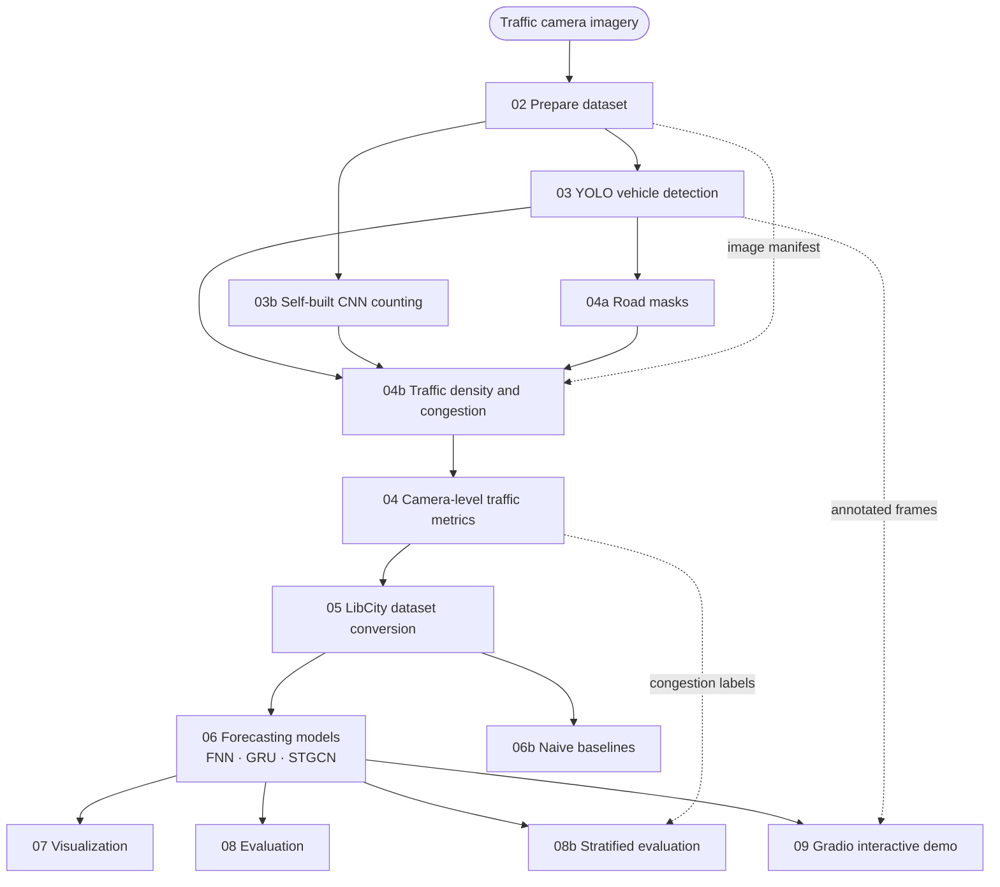

# ISY5002 Traffic Recognition and Prediction Prototype

*English · [中文](README.zh.md)*

An end-to-end prototype that turns traffic-camera imagery into **vehicle detection → camera-level traffic metrics → traffic density and congestion assessment → time-series forecasting → an interactive demo**.

---

## Environment

Requires conda and Python 3.11+ (developed on 3.13).

```bash
conda create -n isy5002-project python=3.13 -y
conda run -n isy5002-project python -m ensurepip --upgrade

# 1) Install torch first
conda run -n isy5002-project python -m pip install torch torchvision \
    --index-url https://download.pytorch.org/whl/cu128

# 2) Then the remaining dependencies
conda run -n isy5002-project python -m pip install -r requirements.txt
```

```bash
conda run -n isy5002-project python -m pip install torch torchvision
```

```bash
conda run -n isy5002-project python -c "import torch; print(torch.cuda.is_available())"
```

---

## Datasets

The project uses two kinds of data: **traffic-camera imagery collected by this project** (the primary data), and **one external dataset** (used to pre-train the counting model).

### Collected by this project: traffic-camera imagery

Images come from LTA's (Land Transport Authority, Singapore) public traffic-camera API. The historical collection was carried out by a teammate; the collection scripts and the published dataset are at:

**<https://github.com/waiwai033/ISY5002-Traffic-DATAfetch>**

The two batches are stored **under separate dataset tags**:

| Tag | Cameras | Time range | Images | Sampling interval |
|---|---|---|---|---|
| `2025-10-week` | 2701,2702,2704,2706,4703,4707,4712,4713 | 2025-10-15 → 10-22 | 11,677 | 5 min |
| `2026-week1` | 2701,2702,2704,4703,4712,4713,4798,4799 | 2026-09-13 → 09-20 | 7,321 | 10 min |

Place them one directory per camera, with the directory name equal to `camera_id`:

```
datasets/raw-old/<camera_id>/*.jpg
datasets/raw-2026-week1/<camera_id>/*.jpg
```

`datasets/` is gitignored — fetch the data separately via the link above.

### External dataset: TRANCOS_v3

The self-built counting CNN is first pre-trained on **TRANCOS_v3** (GRAM-TRANCOS — Spanish DGT traffic-monitoring cameras, point annotations), then domain-adaptively fine-tuned on this project's own YOLO pseudo-labels. `train/weights/best.pt` is the TRANCOS-pretrained checkpoint and `best_lta.pt` is the fine-tuned result.

The dataset is distributed under GPL-3.0 and requires citation:

```bibtex
@InProceedings{TRANCOSdataset_IbPRIA2015,
  Title     = {Extremely Overlapping Vehicle Counting},
  Author    = {Ricardo Guerrero-Gómez-Olmedo, Beatriz Torre-Jiménez, Roberto López-Sastre,
               Saturnino Maldonado Bascón, and Daniel Oñoro-Rubio},
  Booktitle = {Iberian Conference on Pattern Recognition and Image Analysis (IbPRIA)},
  Year      = {2015}
}
```

### API key (optional)

Only stage 00 (fetching the latest camera coordinates and one reference image from the API) needs a key; **the main pipeline is offline and does not use one**:

```bash
cp .env.example .env     # then fill in your own LTA DataMall key
```

---

## Architecture

### Pipeline overview

**Figure 1** shows the execution order of the stages and their main data dependencies. Solid edges are the pipeline backbone; dotted edges are side inputs (image manifest and congestion labels); the full set of inputs for each stage is in the table below.



Each numbered script can in principle be run on its own, writing its results into a numbered directory under `results/<dataset-tag>/`. Every stage except 00 accepts `--dataset-tag`.

### Stage reference

| Stage | What it does | Technique / model | Output |
|---|---|---|---|
| **02** Prepare dataset | Validate that every image is readable, parse capture time from the filename, detect duplicate content | Pillow validation + regex parsing | Image manifest + quality report |
| **03** Vehicle detection | Find and classify vehicles in each frame | **YOLO26m** (Ultralytics pretrained weights; detects the COCO classes `car`/`motorcycle`/`bus`/`truck`/`bicycle`) | Per-box detections + annotated frames |
| **03b** CNN counting | Skip bounding boxes and regress "how many vehicles are in this image" directly | **Self-built `CountNet`**: a CSRNet-style fully-convolutional density-regression network (~3.5M parameters) producing a 1/8-resolution density map whose **sum is the vehicle count**. Pretrained on TRANCOS, then domain-adaptively fine-tuned using this project's YOLO box centres as pseudo-points | One count per image + density centre points |
| **04a** Road masks | Automatically segment the **road region** of each camera (mounts are fixed, so this is done once per camera) | Unsupervised: accumulate detection boxes over thousands of frames into a **per-pixel coverage** map, threshold it, then morphological and connected-component processing. Ships a human-verification overlay | One binary mask per camera (used downstream only after confirmation) |
| **04b** Density and congestion | Convert "vehicle count" into **vehicle density** and assign a congestion band | Density = road-mask pixels covered by vehicles ÷ mask pixels (`occ_px`); bands assigned by **percentile within the same camera and hour of day** (free / moderate / congested); a measurability gate uses detection confidence and a **clean-plate residual** | Per-frame density and congestion band |
| **04** Camera-level metrics | Join the above into one primary table, per image | Left join | `traffic_metrics.csv` |
| **05** LibCity conversion | Align capture times to a fixed grid and emit LibCity atomic files | Sampling interval is **inferred from the data** | `.geo` / `.rel` / `.dyna` |
| **06** Forecasting models | Predict the next 12 camera-level counts from the previous 12 | **FNN** (flattened-input baseline), **GRU** (recurrent), **STGCN** (spatio-temporal graph convolution over a hand-configured corridor graph); implemented by LibCity, chronological 60/20/20 split | Per-model predictions and metrics |
| **06b** Naive baselines | Answer "how much better are these models than learning nothing?" | persistence (repeat the last observation) + seasonal-naive (same time of day yesterday), on **exactly the same** split as stage 06 | Baseline metrics |
| **07** Visualization | Plot prediction curves and per-camera error charts | matplotlib | PNG |
| **08 / 08b** Evaluation | Aggregate metrics across batches; and split the error by **the congestion band at the target time** to see whether models do worse when congested | — | Evaluation tables and stratified metrics |
| **09** Demo | Interactive web page: side-by-side YOLO boxes, CNN density heatmap, forecast comparison and congestion readout | **Gradio** | Web page |

### What you get

Given **a camera** and **a time point**, the web page shows, at once:

- the frame's **YOLO detection boxes** and **CNN density heatmap** (clipped to the automatically segmented road region);
- that moment's **vehicle count**, **road-area fraction**, **traffic density** and **congestion band** (relative to that camera's own norm at that time of day);
- the three models' **predictions and errors** at 10 / 30 / 120 minutes ahead.

The command-line pipeline additionally produces the complete set of intermediate data and evaluation results for the report and further analysis.

---

## LibCity submodule

The forecasting stage uses [LibCity](https://github.com/LibCity/Bigscity-LibCity) (a spatio-temporal data-mining library), included as a git submodule:

```bash
git submodule update --init third_party/LibCity
```

---

## Running the full pipeline

```bash
P="conda run -n isy5002-project python"
T="--dataset-tag 2026-week1"

$P src/02_prepare_dataset.py           $T
$P src/03_run_yolo_detection.py        $T --camera-id all --limit 0 --model yolo/yolo26m.pt
$P src/03b_run_cnn_count.py            $T --camera-id all --limit 0
$P src/04a_build_road_masks.py                          # camera-level asset; only needed when cameras change
$P src/04b_compute_congestion.py       $T --build-plates --residual
$P src/04_aggregate_traffic_metrics.py $T              # left-joins the 04b density/congestion columns
$P src/05_prepare_libcity_dataset.py   $T
$P src/06_run_libcity_experiment.py    $T              # FNN / GRU / STGCN, the slowest stage
$P src/06b_run_baselines.py            $T              # naive baselines
$P src/07_visualize_traffic.py         $T
$P src/08_evaluate_models.py           $T
$P src/08b_stratify_by_congestion.py   $T              # error split by congestion band
$P src/09_run_mvp_demo.py              $T              # Gradio, CTRL-C to quit
```

---

## Directory layout

```
datasets/                 Image datasets (gitignored)
  raw-old/                2025-10-15..22, 8 cameras, 5-min sampling, 11,677 images
  raw-2026-week1/         2026-09-13..20, 8 cameras, 10-min sampling, 7,321 images

road_masks/               Per-camera road masks
  <camera_id>.png         Binary mask
  <camera_id>.json        Metadata (area fraction, horizon line, lane count, whether reviewed)
  <camera_id>_cleanplate.jpg  Temporal-median clean plate (for the residual signal)
  review/                 Human-verification overlays (gitignored; regenerate with 04a --review)

results/                  Entirely gitignored
  <dataset-tag>/<NN_stage>/…

src/                      Numbered stage scripts + two shared libraries
  dataset_paths.py        Tag resolution, path resolution
  road_geometry.py        Masks, horizon lines, perspective weighting, occupancy
train/                    Pretraining and domain-adaptive fine-tuning of the self-built CNN (CountNet)
  TRANCOS_v3/             External dataset

third_party/LibCity/      Git submodule
docs/                     Architecture and known limitations, results summary, results/ layout
reference/                Course requirements
```

Stage order: `00 → 02 → 03 → 03b → 04a → 04b → 04 → 05 → 06 → 06b → 07 → 08 → 08b → 09`
(Stage 01, the data collection, was carried out by a teammate — see "Datasets".)

---

## Notes

**`--limit` defaults to 5.** To process everything you must pass `--limit 0` explicitly; otherwise each camera contributes only 5 frames.

**Stage `03` overwrites its detection output.** A single stray run truncates the whole `frame_detections.csv`. Confirm `--limit 0` before re-running.

**Do not change stage `03b`'s weights.** The default is the domain-adapted `best_lta.pt`; the TRANCOS-only `best.pt` substantially over-counts on this project's imagery (about 4.8× on average in our measurements).

**Do not trust counts at night.** The detector's recall and confidence both collapse after dark. Stage `04b`'s `measurable` gate marks such frames as unmeasurable and **emits an empty label**.

**Results from the two batches are not directly comparable.** The same "step 12" means 60 minutes at 5-minute sampling but 120 minutes at 10-minute sampling.
