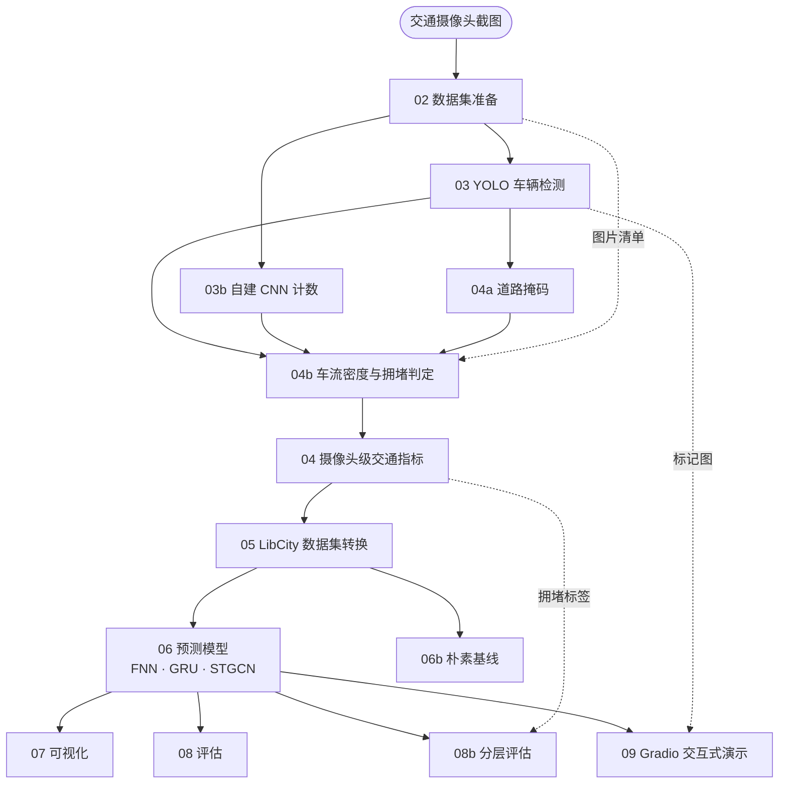

# ISY5002 交通识别与预测原型系统

*中文 · [English](README.md)*

用交通摄像头图像做 **车辆检测 → 摄像头级车流指标 → 车流密度与拥堵判定 → 时间序列预测 → 交互式演示** 的端到端原型。

---

## 环境

需要 conda 与 Python 3.11+（开发环境为 3.13）。

```bash
conda create -n isy5002-project python=3.13 -y
conda run -n isy5002-project python -m ensurepip --upgrade

# 1) 先装 torch
conda run -n isy5002-project python -m pip install torch torchvision \
    --index-url https://download.pytorch.org/whl/cu128

# 2) 再装其余依赖
conda run -n isy5002-project python -m pip install -r requirements.txt
```

```bash
conda run -n isy5002-project python -m pip install torch torchvision
```

```bash
conda run -n isy5002-project python -c "import torch; print(torch.cuda.is_available())"
```

---

## 数据集

本项目用到两类数据：**自己采集的交通摄像头截图**（主数据），以及**一个外部数据集**（用于预训练计数模型）。

### 自采集：交通摄像头截图

图像来自 LTA（新加坡陆路交通管理局）公开的交通摄像头接口。历史采集由课程同学完成，采集脚本与发布在：

**<https://github.com/waiwai033/ISY5002-Traffic-DATAfetch>**

两批数据**按数据集标签隔离存放**：

| 标签 | 相机 | 时间范围 | 图片数 | 采样间隔 |
|---|---|---|---|---|
| `2025-10-week` | 2701,2702,2704,2706,4703,4707,4712,4713 | 2025-10-15 → 10-22 | 11,677 | 5 分钟 |
| `2026-week1` | 2701,2702,2704,4703,4712,4713,4798,4799 | 2026-09-13 → 09-20 | 7,321 | 10 分钟 |

按相机分目录放置，目录名即 `camera_id`：

```
datasets/raw-old/<camera_id>/*.jpg
datasets/raw-2026-week1/<camera_id>/*.jpg
```

`datasets/` 被 gitignore，需要按上面的链接单独获取。

### 外部数据集：TRANCOS_v3

自建的计数 CNN 先在 **TRANCOS_v3**（GRAM-TRANCOS，西班牙 DGT 交通监控摄像头，点标注）上预训练，再用本项目的 YOLO 伪标签做领域自适应微调。`train/weights/best.pt` 是 TRANCOS 预训练权重，`best_lta.pt` 是其微调结果。

该数据集按 GPL-3.0 分发，使用时需引用：

```bibtex
@InProceedings{TRANCOSdataset_IbPRIA2015,
  Title     = {Extremely Overlapping Vehicle Counting},
  Author    = {Ricardo Guerrero-Gómez-Olmedo, Beatriz Torre-Jiménez, Roberto López-Sastre,
               Saturnino Maldonado Bascón, and Daniel Oñoro-Rubio},
  Booktitle = {Iberian Conference on Pattern Recognition and Image Analysis (IbPRIA)},
  Year      = {2015}
}
```

### API 密钥（可选）

只有阶段 00（拉取最新API接口相机坐标与一张参考图）需要密钥，**主流程不联网、不需要它**：

```bash
cp .env.example .env     # 然后填入自己的 LTA DataMall key
```

---

## 系统架构

### 流程总览

**图 1** 给出各阶段的执行顺序与主要数据依赖。实线为流水线主干，虚线为旁路输入（图片清单与拥堵标签）；每个阶段的完整输入见下一节的表。



编号脚本原则上可以独立运行，各自把结果写入 `results/<数据集标签>/` 下的编号目录，除 00 外都接受 `--dataset-tag`。

### 环节介绍

| 环节 | 做什么 | 技术 / 模型 | 产出 |
|---|---|---|---|
| **02** 数据集准备 | 逐张校验图片可读、从文件名解析拍摄时间、统计内容重复 | Pillow 校验 + 正则解析 | 图片清单 + 质量报告 |
| **03** 车辆检测 | 在每张图上找出车辆并分类 | **YOLO26m**（Ultralytics 预训练权重，检出 COCO 中的 `car`/`motorcycle`/`bus`/`truck`/`bicycle`） | 逐框检测结果 + 标记图 |
| **03b** CNN 计数 | 不画框，直接回归「这张图有多少辆车」 | **自建 `CountNet`**：CSRNet 风格全卷积密度回归网络（约 350 万参数），输出 1/8 分辨率的密度图，**密度图求和即车辆数**。先在 TRANCOS 预训练，再用本项目的 YOLO 框中心当伪点做领域自适应微调 | 每图一个计数值 + 密度中心点 |
| **04a** 道路掩码 | 自动切出画面中的**道路区域**（相机机位固定，所以每个相机只需切一次） | 无监督：累积数千张图的检测框做**逐像素覆盖率**统计，阈值化后做形态学与连通域处理。附带人工确认叠加图 | 每个相机一张二值掩码（确认后才被下游使用） |
| **04b** 密度与拥堵 | 把「车辆数」换算成**车辆密度**，并判定拥堵档位 | 密度 = 掩码内被车辆覆盖的像素 ÷ 掩码像素（`occ_px`）；按**同相机同时段百分位**分自由流/中度/拥堵；用检测置信度与**底图残差**做可测性门控 | 逐帧密度与拥堵档位 |
| **04** 摄像头级指标 | 把上述结果按图片聚合成一张主表 | 左连接 | `traffic_metrics.csv` |
| **05** LibCity 转换 | 把拍摄时间对齐到固定网格，转成 LibCity 的原子文件 | 采样间隔**由数据推断** | `.geo` / `.rel` / `.dyna` |
| **06** 预测模型 | 用过去 12 个时刻的摄像头级计数，预测未来 12 个时刻 | **FNN**（展开输入的基线）、**GRU**（循环网络）、**STGCN**（时空图卷积，用人工配置的走廊区域图）；由 LibCity 实现，按时间 60/20/20 划分 | 逐模型预测与指标 |
| **06b** 朴素基线 | 回答「这些模型比什么都不学强多少」 | persistence（沿用最后一个观测值）+ seasonal-naive（前一天同一时刻），跑在与 06 **完全相同**的划分上 | 基线指标 |
| **07** 可视化 | 画预测曲线与摄像头误差图 | matplotlib | PNG |
| **08 / 08b** 评估 | 汇总跨批次指标；并按**目标时刻的拥堵档位**拆分误差，看模型在拥堵时是否更差 | — | 评估表与分层指标 |
| **09** 演示 | 交互式网页：并排展示 YOLO 检测框、CNN 密度热力图、预测对比与拥堵读数 | **Gradio** | 网页 |

### 最终功能

给定**某个相机**与**某个时间点**，网页会同时给出：

- 该帧的 **YOLO 检测框**与 **CNN 密度热力图**（热力图被限制在自动切出的道路区域内）；
- 该时刻的**车辆数**、**道路面积占比**、**车流密度**与**拥堵档位**（相对该相机该时段的常态）；
- 三个预测模型在未来 10 / 30 / 120 分钟上的**预测值与误差**。

同时，命令行流程会产出完整的中间数据与评估结果，可用于报告与后续分析。

---

## LibCity 子模块

预测阶段使用 [LibCity](https://github.com/LibCity/Bigscity-LibCity)（时空数据挖掘库），以 git submodule 形式引入：

```bash
git submodule update --init third_party/LibCity
```

---

## 跑完整流程

```bash
P="conda run -n isy5002-project python"
T="--dataset-tag 2026-week1"

$P src/02_prepare_dataset.py           $T
$P src/03_run_yolo_detection.py        $T --camera-id all --limit 0 --model yolo/yolo26m.pt
$P src/03b_run_cnn_count.py            $T --camera-id all --limit 0
$P src/04a_build_road_masks.py                          # 掩码是相机级资产，只在换相机时才需要
$P src/04b_compute_congestion.py       $T --build-plates --residual
$P src/04_aggregate_traffic_metrics.py $T              # 会把 04b 的密度/拥堵列左连接进来
$P src/05_prepare_libcity_dataset.py   $T
$P src/06_run_libcity_experiment.py    $T              # FNN / GRU / STGCN，最耗时
$P src/06b_run_baselines.py            $T              # 朴素基线
$P src/07_visualize_traffic.py         $T
$P src/08_evaluate_models.py           $T
$P src/08b_stratify_by_congestion.py   $T              # 按拥堵档位分层看误差
$P src/09_run_mvp_demo.py              $T              # Gradio，CTRL-C 退出
```

---

## 目录结构

```
datasets/                 图片数据集（gitignore）
  raw-old/                2025-10-15..22，8 相机，5 分钟采样，11,677 张
  raw-2026-week1/         2026-09-13..20，8 相机，10 分钟采样，7,321 张

road_masks/               相机级道路掩码
  <camera_id>.png         二值掩码
  <camera_id>.json        元数据（面积占比、灭线、车道数、是否已人工确认）
  <camera_id>_cleanplate.jpg  时间中值底图（残差信号用）
  review/                 人工确认叠加图（gitignore，04a --review 可重生成）

results/                  全部 gitignore
  <dataset-tag>/<NN_stage>/…

src/                      按阶段编号的脚本 + 两个共享库
  dataset_paths.py        标签解析、路径解析
  road_geometry.py        掩码、灭线、透视加权、占用率
train/                    自建 CNN（CountNet）的预训练与领域自适应微调
  TRANCOS_v3/             外部数据集

third_party/LibCity/      git submodule
docs/                     架构与已知缺陷、结果汇总、results/ 布局说明
reference/                课程要求
```

阶段编号顺序：`00 → 02 → 03 → 03b → 04a → 04b → 04 → 05 → 06 → 06b → 07 → 08 → 08b → 09`
（01 阶段的数据采集由组员完成，见「数据集」一节。）

---

## 注意

**`--limit` 的默认值是 5。** 想跑全量必须显式 `--limit 0`，否则每个相机只会处理 5 张。

**`03` 用覆盖模式写检测结果。** 一次误跑会把整份 `frame_detections.csv` 截断，重跑前先确认 `--limit 0`。

**`03b` 的权重不要换。** 默认为领域自适应过的 `best_lta.pt`；只在 TRANCOS 上预训练的 `best.pt` 用在项目中会遇到明显超计（实测平均约 4.8 倍）。

**夜间不要相信计数。** 检测器在夜间的召回率和置信度都会大幅下降，`04b` 的 `measurable` 门控会把这类帧标为不可测并**输出空标签**。

**两批数据的结果不可直接比较。** 同样是「第 12 步」，5 分钟采样是 60 分钟、10 分钟采样是 120 分钟。
