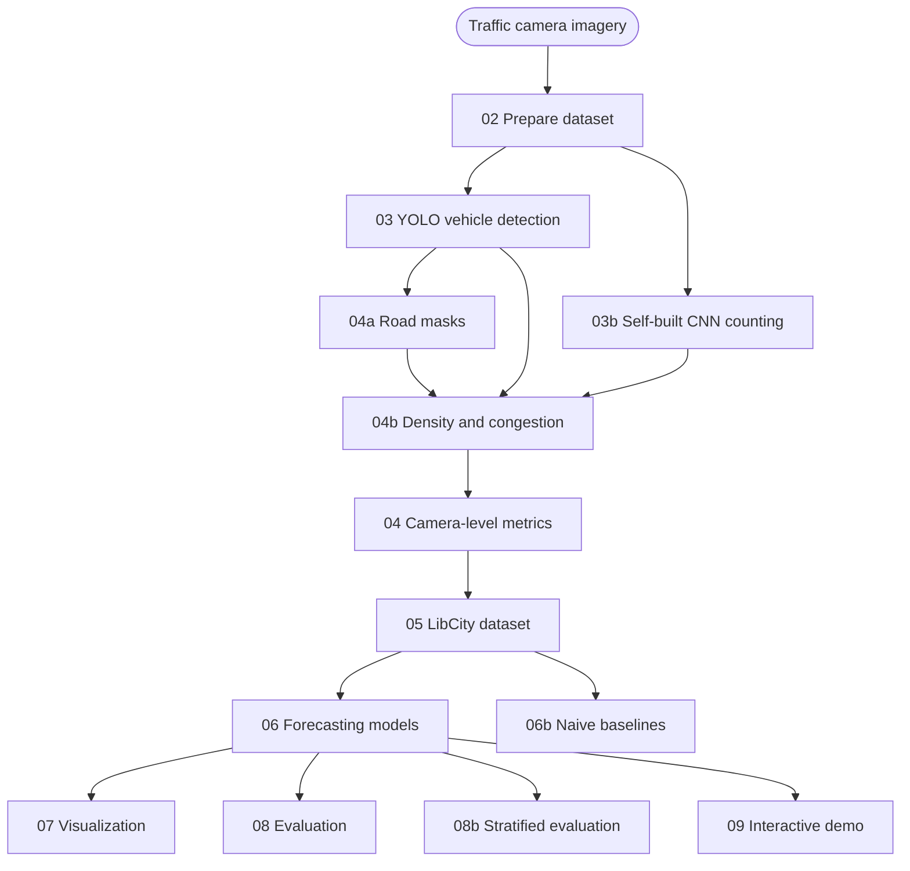

# Project Architecture

*English · [中文](ARCHITECTURE.md)*

## 1. System Overview

The system takes traffic-camera imagery as input and produces camera-level traffic metrics, congestion assessments and short-term traffic forecasts. It is organised in four layers: the perception layer extracts vehicles and road information from images, the metrics layer arranges those results into a regular time series, the forecasting layer trains and compares several models on that series, and the evaluation and demo layer measures performance and presents the results.



Each stage is implemented as a numbered script and can be run on its own. Every stage writes its results into a numbered directory under `results/<dataset-tag>/`, which makes intermediate outputs easy to inspect and problems easy to locate.

## 2. Data

Two batches of traffic-camera imagery are used, both obtained from LTA's public endpoint:

| Dataset tag | Cameras | Time range | Images | Sampling interval |
|---|---|---|---|---|
| `2025-10-week` | 8 | 2025-10-15 to 10-22 | 11,677 | 5 minutes |
| `2026-week1` | 8 | 2026-09-13 to 09-20 | 7,321 | 10 minutes |

The two batches differ in both camera set and sampling interval: the first includes cameras 2706 and 4707, while the second replaces them with 4798 and 4799, and the interval changes from 5 to 10 minutes. All outputs are kept under separate **dataset tags**, so the two batches never overwrite each other and can be retained and compared side by side.

## 3. Perception Layer

### 3.1 Dataset Preparation (02)

The stage scans the image directory recursively, validates that every image is readable, parses capture time from the filename, and counts duplicate content. It emits a deliberately minimal manifest:

```
camera_id, image_path
```

Downstream stages depend only on these two columns, so changing the dataset or reorganising the directory layout does not require changes further down the pipeline. Duplicate images are reported but not deleted, since identical frames still carry information for diagnostics and for judging whether de-duplication is warranted.

### 3.2 Vehicle Detection (03)

Vehicles are detected with Ultralytics YOLO. Vehicle classes are not hard-coded as class indices; they are selected by name from the model's own class name table (car, motorcycle, bus, truck, bicycle), so swapping in a different detector version requires no code changes.

The inference size is set to 1280 pixels. Distant vehicles occupy only 6 to 10 pixels in width; at a lower input resolution this group is missed, and it represents a meaningful share of the vehicles relevant to congestion.

The output is a per-box detection table (class and confidence) together with annotated frames for inspection.

### 3.3 Self-built Counting Network (03b)

Alongside the detector, the system includes a self-built counting network, `CountNet`, which provides an independent count. It performs no object detection; instead it regresses the number of vehicles in an image directly: a single image goes in, a density map at one-eighth resolution comes out, and the sum of the density map is the vehicle count.

The network is a CSRNet-style fully-convolutional network with roughly 3.5 million parameters:

```
input (3, H, W)
  -> three downsampling stages (two 3x3 conv + BN + ReLU each, then max-pool) -> 1/8
  -> four dilated convolution layers (dilation 1/2/4/2, widening the receptive field) -> 1/8
  -> 1x1 convolutional linear output                                        -> (1, H/8, W/8)
```

Two design points matter. The output head is a linear convolution rather than an activated one, because a density regression output should not be clamped by an activation function. And because the network is fully convolutional and resolution-independent, a single set of weights works across input aspect ratios.

Training uses point supervision in two stages:

- **Pretraining** on the public point-annotated dataset TRANCOS_v3, to learn the density-from-centres task itself. Each annotated centre becomes a unit impulse; after Gaussian blurring and 8x8 block summation this yields a density map whose sum corresponds to the vehicle count.
- **Domain-adaptive fine-tuning.** TRANCOS depicts Spanish motorways, which differs substantially from this project's border-crossing scenes; transferring directly makes the model over-respond to unfamiliar texture. The detector's box centres are therefore used as pseudo-points to continue training on local imagery, so that density is produced only where vehicles actually are. The fine-tuned weights are stored separately and do not overwrite the pretrained ones.

### 3.4 Road Region Segmentation (04a)

The road occupies only part of each frame, and its share varies considerably between cameras. The same vehicle count means very different things on a narrow view and a wide one, so the road region of each camera is determined first.

Camera mounts are fixed and the road region does not change over time, so the mask is a **per-camera constant**: it is computed once per camera and reused across all datasets.

Segmentation is based on detection results rather than on image segmentation. All detection boxes for a camera are accumulated, the fraction of images in which each pixel is covered by a vehicle is measured, and that coverage map is thresholded to obtain the road region, followed by morphological processing and connected-component filtering. Detection boxes are themselves high-confidence samples of "this is road surface", and coverage statistics suppress occasional false positives. Image segmentation, by contrast, is unreliable in these scenes: water and asphalt are close in grey level, and the carriageway runs directly alongside tree canopy.

All significant connected components must be kept rather than only the largest, because a single camera may see two carriageways that are physically separated.

A mask is used downstream only after human confirmation, and is stored with the codebase as a per-camera asset.

### 3.5 Density and Congestion (04b)

Vehicle counts are converted into density:

```
occ_px = road-mask pixels covered by vehicles / total mask pixels
```

The unweighted pixel measure is used as the primary metric. Perspective weighting could in principle convert pixel area into ground area, but the horizon line cannot be recovered reliably from the imagery, and within a single camera the weighting barely changes the ranking of frames; the weighted version is therefore retained only as a sensitivity analysis.

The congestion band is determined by the density percentile **within the same camera and the same hour of day**, in three bands: free-flowing, moderate and congested. Normalising per camera and per hour removes scale differences between cameras as well as the diurnal shape of traffic, so the band expresses "is this frame more congested than this camera's own norm at this time of day".

A measurability gate runs before the band is assigned. In night-time imagery the detector's recall and confidence both fall sharply; without a gate, night would be classified as free-flowing simply because few vehicles were detected, presenting a measurement failure as an observation. The gate combines detection confidence, box size and a clean-plate residual; if any of them indicates an untrustworthy measurement, no band is emitted for that frame.

## 4. Metrics and Dataset Construction

### 4.1 Camera-level Metrics (04)

Detection, counting and density results are aggregated per image into one primary table. Each row corresponds to one image and carries the camera identifier, capture time, total vehicle count, per-class counts, detection confidence, the CNN count, density and congestion band. This table is the direct input to forecasting and the data source for the demo interface.

### 4.2 LibCity Dataset Conversion (05)

Image-level records are converted into the three atomic files LibCity expects:

- `.geo`: camera identifier, coordinates and region
- `.rel`: connections between cameras within the same region
- `.dyna`: traffic records per camera per time step

Capture times are floored onto a regular grid at a fixed interval. The interval is inferred from the data rather than fixed as a constant, because the two batches differ; the interval also determines the prediction step and horizon, so hard-coding it would misalign the time axis. Where a camera has no record at a time step, a zero is inserted and flagged, producing the regular tensor LibCity requires.

Region grouping is a corridor-level division used to generate the connections in `.rel`. It expresses which region a camera belongs to; it does not represent the precise physical road in any screenshot, and is not used as a lane label.

## 5. Forecasting Layer

### 5.1 Forecasting Models (06)

Three models are trained and compared on the camera-level traffic series:

| Model | Role | Characteristics |
|---|---|---|
| FNN | Baseline | Learns a non-linear mapping from the flattened input window |
| GRU | Primary temporal model | Models temporal dependence through a recurrent state |
| STGCN | Spatio-temporal graph model | Models temporal variation and the regional graph between cameras jointly |

The input is the past 12 time steps of all cameras; the output is the next 12 steps. Data is split chronologically into 60% training, 20% validation and 20% test. All three models share the same data, the same split and the same evaluation protocol, so their results are directly comparable.

### 5.2 Naive Baselines (06b)

To show how much the models improve on "no learning at all", two baselines are added:

- **persistence**: the last observation of the input window is repeated across the whole forecast horizon
- **seasonal-naive**: the value at the same time of day on the previous day is used as the forecast

Both baselines are computed on exactly the same split and grid as the forecasting models, with identical metric definitions.

## 6. Evaluation and Demo

### 6.1 Visualization (07)

The stage plots metric comparisons across models and forecast horizons, along with per-camera prediction curves and error distributions.

### 6.2 Evaluation (08, 08b)

Evaluation has two levels. Stage 08 aggregates overall metrics and per-camera errors across batches. Stage 08b stratifies the error by **the congestion band at the forecast target time**, answering a question an aggregate metric cannot: whether the models are markedly worse during congestion than in free flow. Neither stage retrains anything; both consume the outputs of the trained models.

The congestion band is used here only as an evaluation grouping, not as a prediction target. Its definition depends on the full density distribution within the same hour, so using it as a target would introduce information unavailable at prediction time; and the band derives from the same detections as the model inputs, which would amount to asking the model to reproduce a transform of its own input.

### 6.3 Interactive Demo (09)

A web page integrates the results. Given a camera and a time point, the interface presents the detection output and density heatmap for that frame, the traffic statistics and congestion band for that moment, and each model's predictions and errors over several horizons. The density heatmap is displayed only within the road mask, so the density shown in the interface uses the same definition as the metrics layer.

## 7. Scope and Limitations

The unit of analysis is the camera, not the lane or an individual road. The source imagery reliably supports the question "how many vehicles are in this view", but not lane-level attribution, so the system does not report lane-level or road-level flow.

The following limitations should be kept in mind when interpreting results:

- Counts come from single-frame recognition with no cross-frame tracking, so the same vehicle is counted again in consecutive frames. The value therefore represents vehicles visible in a frame, not traffic flow in the strict sense.
- The detector uses pretrained weights and has not been evaluated for precision and recall on a manually labelled set from this project; the counting network's validation metric is its disagreement with the detector, not an absolute ground truth.
- The time span and number of cameras are limited, and models are evaluated on a single chronological split; a single result does not establish stable performance.
- Imputing missing records as zero equates "missing data" with "no vehicles", which introduces bias when many records are missing.
- The two batches differ in sampling interval and camera set, so comparing their metrics directly confounds data differences with model differences.
