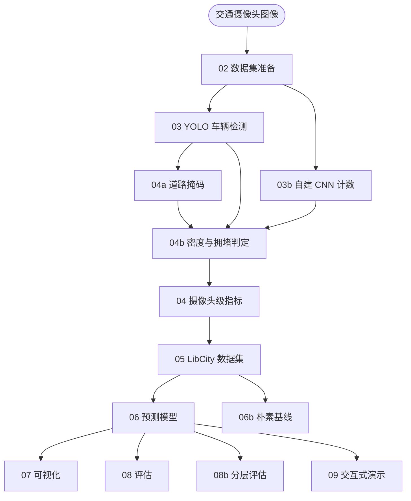

# 项目架构

*中文 · [English](ARCHITECTURE.en.md)*

## 1. 系统概述

本系统以交通摄像头图像为输入，输出摄像头级的车流指标、拥堵判定与未来车流预测。整体分为四层：感知层从图像中提取车辆与道路信息，指标层把感知结果整理成规则的时间序列，预测层在该序列上训练并比较多个模型，评估与演示层负责衡量效果并对外呈现。



各阶段以编号脚本实现，可以独立运行。每个阶段把结果写入 `results/<数据集标签>/` 下的编号目录，便于检查中间产物与定位问题。

## 2. 数据

使用两批交通摄像头图像，均来自 LTA 公开接口：

| 数据集标签 | 摄像头 | 时间范围 | 图像数 | 采样间隔 |
|---|---|---|---|---|
| `2025-10-week` | 8 个 | 2025-10-15 至 10-22 | 11,677 | 5 分钟 |
| `2026-week1` | 8 个 | 2026-09-13 至 09-20 | 7,321 | 10 分钟 |

两批数据的摄像头集合与采样间隔都不同：前者包含 2706 与 4707，后者替换为 4798 与 4799；采样间隔由 5 分钟变为 10 分钟。系统按**数据集标签**隔离两批数据的全部产物，避免互相覆盖，也使两批结果可以并行保留与对照。

## 3. 感知层

### 3.1 数据集准备（02）

递归扫描图像目录，逐张校验可读性，从文件名解析拍摄时间，并统计内容重复。输出一份刻意保持最小的清单：

```
camera_id, image_path
```

下游阶段只依赖这两列，因此后续更换数据集或调整目录结构时不必改动下游代码。重复图像只被记录、不自动删除，因为同一画面在诊断与去重判断上仍有参考价值。

### 3.2 车辆检测（03）

使用 Ultralytics 的 YOLO 检测器识别图像中的车辆。车辆类别不是写死类别编号，而是从模型自身的类别名称表中筛选（car、motorcycle、bus、truck、bicycle），因此更换不同版本的检测器权重时无需修改代码。

检测尺寸设为 1280 像素。摄像头画面中远处的车辆仅占 6 至 10 像素宽，较低的输入分辨率会导致这部分车辆漏检，而它们在拥堵判定中占比可观。

输出为逐框检测结果（含类别与置信度）以及供人工检查的标记图。

### 3.3 自建计数网络（03b）

除检测器外，系统自建了一个车辆计数网络 `CountNet`，作为一个独立的计数口径。它不做目标检测，而是直接回归图像中的车辆数量：输入单张图像，输出一张八分之一分辨率的密度图，密度图求和即为车辆数。

网络结构为 CSRNet 风格的全卷积网络，约 350 万参数：

```
输入 (3, H, W)
  → 三级下采样（每级两个 3×3 卷积 + BN + ReLU，后接最大池化）→ 1/8
  → 四层空洞卷积（dilation 1/2/4/2，扩大感受野）          → 1/8
  → 1×1 卷积线性输出                                    → (1, H/8, W/8)
```

两个设计要点：输出头使用线性卷积而非带激活的卷积，因为密度回归的输出不应被激活函数截断；网络全卷积且与输入分辨率无关，因此同一份权重可以在不同长宽比的输入上使用。

训练采用点监督的两阶段方案：

- **预训练**：在公开的点标注数据集 TRANCOS_v3 上训练，学习「按中心点生成密度」这一任务本身。每个标注中心点生成单位脉冲，经高斯模糊后按 8×8 分块求和，得到与车辆数对应的密度图。
- **领域自适应微调**：TRANCOS 为西班牙高速场景，与本项目的口岸场景存在明显域差，直接迁移会导致模型对陌生纹理过度响应。因此以本项目检测器的框中心作为伪点，在本地图像上继续微调，使模型只在确有车辆的位置产生密度。微调权重单独保存，不覆盖预训练权重。

### 3.4 道路区域分割（04a）

摄像头画面中道路只占一部分，且各摄像头占比差异很大。同一个车辆数在窄画面与宽画面上代表完全不同的拥挤程度，因此需要先确定每个摄像头的道路区域。

摄像头机位固定，道路区域不随时间变化，因此掩码是**摄像头级常量**，每个摄像头计算一次即可供所有数据集复用。

分割方法基于检测结果而非图像分割：累积该摄像头的全部检测框，统计每个像素被车辆覆盖的图像比例，据此阈值化得到道路区域，再经形态学处理与连通域筛选。检测框本身就是「此处为路面」的高置信样本，覆盖率统计可以滤除偶发误检；而图像分割在本地场景并不可靠，例如水面与沥青在灰度上接近、路面紧邻树冠。

需要保留所有面积达标的连通域，而非只保留最大的一块：单个摄像头可能同时看到两条被物理分隔的车行道。

掩码在人工确认后才被下游使用，并作为摄像头级资产随代码库一并保存。

### 3.5 密度与拥堵判定（04b）

把车辆数换算为密度：

```
occ_px = 道路掩码内被车辆覆盖的像素数 ÷ 掩码像素总数
```

采用未加权的像素口径作为主指标。透视加权在原理上可以把像素面积折算为地面面积，但灭线位置无法从图像可靠反解，且在单个摄像头内部，加权与否几乎不改变各帧的排序，因此加权版本仅作为敏感性分析保留。

拥堵档位由**同一摄像头、同一时段**的密度百分位决定，分为自由流、中度、拥堵三档。按摄像头与时段分别归一化，可以消除摄像头之间的尺度差异以及昼夜之间的流量形态差异，使档位表达「相对于该摄像头在该时段的常态，这一帧是否更拥挤」。

判定前有一道可测性门控。夜间图像中检测器的召回率与置信度均显著下降，若不加限制，夜间会因「检出车辆少」而被判定为畅通，把测量失败呈现为观测结果。门控综合检测置信度、检测框尺寸与底图残差三项信号，任一项表明测量不可信时，该帧不输出档位。

## 4. 指标与数据集

### 4.1 摄像头级指标（04）

把检测、计数与密度结果按图像聚合成一张主表。表的每一行对应一张图像，包含摄像头编号、拍摄时间、车辆总数、各车辆类别数量、检测置信度、CNN 计数、密度与拥堵档位。该表是预测阶段的直接输入，也是演示界面读取的数据源。

### 4.2 LibCity 数据集转换（05）

把图像级记录转换为 LibCity 所需的三种原子文件：

- `.geo`：摄像头编号、坐标与所属区域
- `.rel`：同一区域内摄像头之间的连接关系
- `.dyna`：每个摄像头在每个时刻的车流记录

拍摄时间按固定间隔向下对齐到规则网格。采样间隔由数据自身推断，而不写死为常量，因为两批数据的间隔不同；间隔同时决定预测步长与预测跨度，写死会使时间轴错位。某一摄像头在某个时刻缺失记录时补零并标记，以形成规则张量。

区域分组为走廊级划分，用于生成 `.rel` 中的连接关系。它表达摄像头之间的区域归属，不代表截图中的精确物理道路，也不作为车道标签使用。

## 5. 预测层

### 5.1 预测模型（06）

在摄像头级车流序列上训练并比较三个模型：

| 模型 | 角色 | 特点 |
|---|---|---|
| FNN | 基线 | 将输入窗口展平后学习非线性映射 |
| GRU | 主要时序模型 | 以循环状态建模时间依赖 |
| STGCN | 时空图模型 | 同时建模时间变化与摄像头之间的区域图关系 |

输入为过去 12 个时刻的全部摄像头读数，输出为未来 12 个时刻。数据按时间顺序划分为 60% 训练、20% 验证、20% 测试。三个模型共享同一份数据、同一划分与同一评估口径，因此结果可以直接比较。

### 5.2 朴素基线（06b）

为了说明模型相对「不做学习」的基准提升了多少，补充两条基线：

- **persistence**：以输入窗口的最后一个观测值作为整个预测跨度的预测
- **seasonal-naive**：以前一日同一时刻的值作为预测

两条基线在与预测模型完全相同的划分与网格上计算，指标口径一致。

## 6. 评估与演示

### 6.1 可视化（07）

绘制各模型在不同预测跨度上的指标对比，以及逐摄像头的预测曲线与误差分布。

### 6.2 评估（08、08b）

评估分为两级。阶段 08 汇总跨批次的整体指标与逐摄像头误差。阶段 08b 按**预测目标时刻的拥堵档位**对误差分层，用以回答一个整体指标无法回答的问题：模型在拥堵时的误差是否明显高于自由流时。这两个阶段都只使用已训练模型的输出，不重新训练。

拥堵档位在此仅作为评估的分组依据，不作为预测目标。档位的定义依赖同一时段内的完整密度分布，用作预测目标会引入预测时不可得的信息；且档位与模型输入出自同一批检测结果，以此为目标接近于让模型复现输入的变换。

### 6.3 交互式演示（09）

以网页形式集成全部结果。给定摄像头与时间点，界面同时呈现该帧的检测结果与密度热力图、该时刻的车流统计与拥堵档位、以及各模型在未来若干跨度上的预测值与误差。密度热力图限制在道路掩码范围内显示，使界面上呈现的密度与指标层使用的密度口径一致。

## 7. 范围与限制

系统的分析单位是摄像头，不是车道或单条道路。原始截图能够稳定支持「画面中有多少车辆」这一判断，但不足以支撑车道级归属，因此系统不输出车道级或道路级流量。

以下限制在解读结果时需要一并考虑：

- 车辆数来自单帧识别，没有跨帧跟踪，连续画面中的同一车辆会被重复计数，因此该数值表示画面中的车辆数，而非严格意义上的交通流量。
- 检测器使用预训练权重，尚未在本项目的人工标注集上评估精确率与召回率；计数网络的验证指标是它与检测器之间的差异，不是绝对真值。
- 数据的时间范围与摄像头数量有限，模型只在一次按时间顺序的划分上评估，单次结果不足以代表稳定性能。
- 缺失记录补零的处理会把「数据缺失」与「没有车辆」等同，缺测较多时会引入偏差。
- 两批数据的采样间隔与摄像头集合不同，直接比较两者的指标会混淆数据差异与模型差异。
